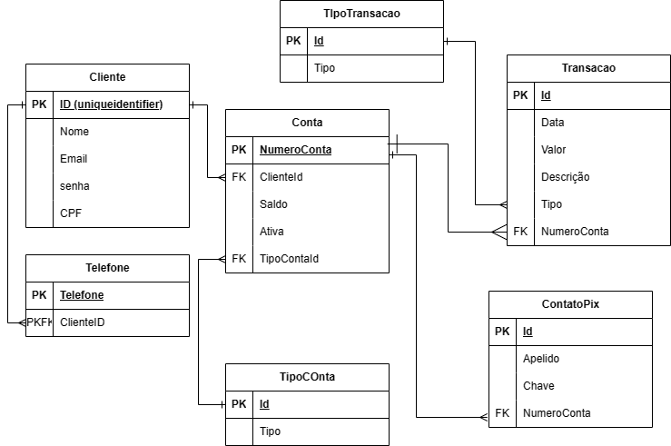

# LabBank

Labbank é um projeto colaborativo com o intuito de aprofundar os conhecimentos dos alunos do Lab365, com a imersão no dia a dia do desenvolvimento, a ideia partiu do Professor Mika, de criar um software bancário com o intuito colaborativo e com o apoio de docentes para direcionamento do desenvolvimento. 

MER: 

## [LabBank Frontend](https://github.com/mikansc/labbank-frontend-mk)
